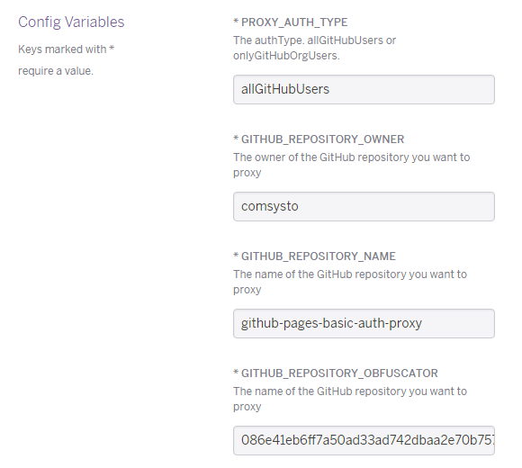

#### GitHub Pages Basic Auth Proxy by comSysto

[](https://heroku.com/deploy)


A simple python based proxy to secure github pages with basic auth via a small cloud-proxy-instance.
Basic Auth checks against GitHub API. This little piece of software is brought to you by comSysto.
*comSysto is not a representative of GitHub. GitHub and the GitHub logos are Trademarks of GitHub inc.* 

**TOC**
  * [1. Introduction](#1-introduction)
  * [2. Installation on Heroku](#2-installation-on-heroku)
  * [3. Installation on AWS](#3-installation-on-aws)
  * [4. Roadmap](#4-roadmap)
  * [5. License](#5-license)

## 1. Introduction

:bangbang: **BETA: THIS IS WORKING BUT NOT RECOMMENDED FOR PRODUCTION USE!** :bangbang: 
 
### 1.1 Demo

  * Secured Page by Proxy:
    * https://my-secure-github-page.comsysto.com/
    * You can login on the page with your GitHub Username and [personal access token](https://help.github.com/articles/creating-an-access-token-for-command-line-use/) (which can have no scopes)
    * The proxy is running on this instance with the following parameters (you can see below what that means)
      * `cs-gh-proxy -e wsgi -p 8881 --authType allGitHubUsers --owner comsysto --repository github-pages-basic-auth-proxy --obfuscator 086e41eb6ff7a50ad33ad742dbaa2e70b75740c4950fd5bbbdc71981e6fe88e3 &`
  * GitHub Page that is proxied:
    * https://comsysto.github.io/github-pages-basic-auth-proxy/086e41eb6ff7a50ad33ad742dbaa2e70b75740c4950fd5bbbdc71981e6fe88e3/
    * (normally you would not tell anyone that URL. But just that you see that these pages are identical)
 
### 1.2 Who needs this?

  * If you have a GitHub organization account with organization members.
  * If you have a private organization github repository.
  * If you have a `gh-pages` branch in that repository.
  * And if you want to secure the gh-pages page via basic auth, then this proxy is for you.
    * Only members of the GitHub organization OR normal GitHub users will have access
  
### 1.3 What it will do


  * Proxy between GitHub Pages and User (Only GET requests)
  * Ask for Authentication (github credentials)
    * either GitHub username and password
    * Or GitHub username and access_token
  * Only proxy through if user is member of GitHub Organization or normal GitHub user (depends on how you run proxy)
  * To not have to call github api on every request we authenticate once and a [JWT Token](https://jwt.io/) is generated and stored in a cookie
    * the JWT Token is valid for 4 hours.
    * After the Token has expired or the cookie is removed you will have to perform Authentication again.
  
### 1.4 Is it really secure?
 
  * Basically `gh-pages` URLs are public. But if you use a private repository you can only **guess** the actual URLs. 
  * If you create a directory in your `gh-pages` branch which is called e.g. `086e41eb6ff7a50ad33ad742dbaa2e70b75740c4950fd5bbbdc71981e6fe88e3` and proxy to this dir, it will be secure as long as no one knows **obfuscator** (you should keep it secret).
  * You proxy to https (TLS) so no man in the middle attack could get a hold of the obfuscator.

### 1.5 Is it fast?
 
  * The short answer is: meeeeh
  * Currently there is no real good proxy implementation in place that would cache files.
  * So for every GET request you have internal GET calls to github pages whose responses are directly returned to the user.
  * At least the Authentication is fast and optimized via JWT Auth Cookie. That reduces the auth calls on the github API.


## 2. Installation on Heroku

[](https://heroku.com/deploy)

You can automatically setup the heroku instance of the proxy by clicking the button above.

During the install you need to specify `authType`, `owner`, `repository` and `obfuscator`.

  * 


## 3. Installation on AWS

[](https://aws.amazon.com/)

We will do demo setup for the following scenario:
  
  * GitHub Page we want to secure: 
    * https://comsysto.github.io/github-pages-basic-auth-proxy/086e41eb6ff7a50ad33ad742dbaa2e70b75740c4950fd5bbbdc71981e6fe88e3/
    * This is a gh-pages branch of a public repo. In real scenario this would be a private repo and no one could guess the obfuscator.
    * Contents of gh-pages: https://github.com/comsysto/github-pages-basic-auth-proxy/tree/gh-pages  
  * Proxy-URL we want to use: 
    * https://my-secure-github-page.comsysto.com/
    * This is a `ec2.micro` Instance on AWS which is configured as described below.
    
### 3.1 Prerequisites

  * You will need nginx, python 3 and git.
    * on Ubuntu: `apt-get install git nginx python3-setuptools build-essential python3-dev`
  * optional a ssl certificate  

### 3.2 nginx setup

We need some kind of vhost with SSL that proxies everything through to our python proxy.

```
server {
    listen 443;
    server_name my-secure-github-page.comsysto.com;

    ssl on;
    ssl_certificate /etc/ssl/comsysto.crt;
    ssl_certificate_key /etc/ssl/comsysto.key;
    ssl_session_timeout 5m;
    ssl_protocols SSLv3 TLSv1 TLSv1.1 TLSv1.2;
    ssl_ciphers "HIGH:!aNULL:!MD5 or HIGH:!aNULL:!MD5:!3DES";
    ssl_prefer_server_ciphers on;
    
    location / {
        proxy_pass http://127.0.0.1:8881/;
    }
}
```

### 3.3 python proxy setup

Install proxy
```
git clone  https://github.com/comsysto/github-pages-basic-auth-proxy.git
cd github-pages-basic-auth-proxy
sudo python3 setup.py install
```

Run Proxy

  * proxy that allows only members of the organization to access page: (owner must be an GitHub Organization)

```
$> cs-gh-proxy -e wsgi -p 8881 --authType onlyGitHubOrgUsers --owner comsysto --repository github-pages-basic-auth-proxy --obfuscator 086e41eb6ff7a50ad33ad742dbaa2e70b75740c4950fd5bbbdc71981e6fe88e3
```

  * proxy that allows all GitHub Users to access page: (owner can be GitHub Organization or normal user)

```
$> cs-gh-proxy -e wsgi -p 8881 --authType allGitHubUsers --owner comsysto --repository github-pages-basic-auth-proxy --obfuscator 086e41eb6ff7a50ad33ad742dbaa2e70b75740c4950fd5bbbdc71981e6fe88e3
```

  * Howto run python server as daemon
    * first [install daemonize](http://software.clapper.org/daemonize/)
    * now create script `/opt/run-gh-proxy.sh`
    * put run command (see above) in script
    * run as daemon with `/usr/local/sbin/daemonize -p /var/run/cs-gh-proxy.pid -l /var/run/cs-gh-proxy.lock /opt/run-gh-proxy.sh`
      * Now you can write some scripts to check for pidfile or port
      * lockfile ensures that there will only be a single instance

# 4. Roadmap

  * Provide oAuth instead of Basic Auth
  * Enable CORS
  * Enable on-the-fly GZIP compression
  * Enable caching (maybe replace internal proxy mechanism with WSGIproxy)
  * Real logging
  * Provide Ubuntu init Scripts
  * :white_check_mark: Provide Heroku easy install


# 5. License

Licensed under [MIT License](./LICENSE.md)

colors: 
```
türkis   #1e9dcc  #d2ebf5  
green    #99d100  #ebf6cc
orange   #e67800
blue     #1c61b3
```
