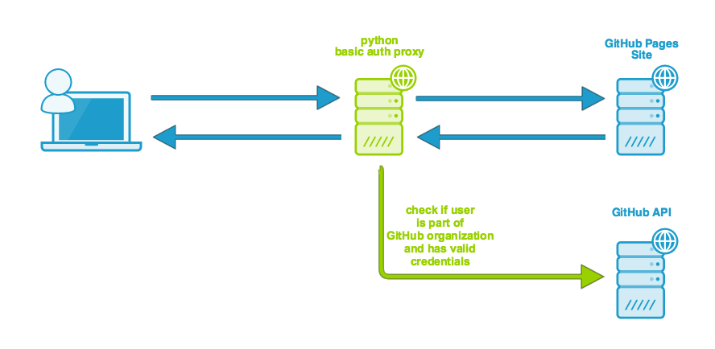

[](https://github.com/comsysto/github-pages-basic-auth-proxy)

#### GitHub Pages Auth Basic Proxy by comSysto

[](https://heroku.com/deploy)

## 1. Introduction

A simple python based proxy to secure github pages with basic auth via a small cloud-proxy-instance.
Basic Auth checks against GitHub API. This little piece of software is brought to you by comSysto.
*comSysto is not a representative of GitHub. GitHub and the GitHub logos are Trademarks of GitHub inc.* 

:bangbang: **BETA: THIS IS WORKING BUT NOT RECOMMENDED FOR PRODUCTION USE!** :bangbang: 
 


### 1.1 Demo


| Secured Page by Auth Basic Proxy | Insecure plain GitHub Pages URL |
|--------------------------|-------------------------------|
| :closed_lock_with_key: https://my-secure-github-page.comsysto.com/ | :unlock:  [https://comsysto.github.io/github-pages-basic-auth-proxy/086e4...fe88e3/](https://comsysto.github.io/github-pages-basic-auth-proxy/086e41eb6ff7a50ad33ad742dbaa2e70b75740c4950fd5bbbdc71981e6fe88e3/) |
| You can login with your GitHub Username and password.  |  (normally you would not tell anyone that URL. It is just here that you see that these pages are identical) |
| Or You can login with your GitHub Username and a [personal access token](https://help.github.com/articles/creating-an-access-token-for-command-line-use/) as password. The token does not need any scopes.| |


## 2. Installation on Heroku

[](https://heroku.com/deploy)

You can automatically setup the heroku instance of the proxy by clicking the button above.


During the install you need to specify `authType`, `Repository-Owner`, `Repository-Name` and `Obfuscator`.


## 3. Installation on AWS

Click below to see the full instructions on how to manually setup the proxy on AWS.

[](./doc/Howto-Install-on-AWS.md)


## 4. Roadmap

  * Provide oAuth instead of Basic Auth
  * Enable CORS
  * Enable on-the-fly GZIP compression
  * Enable caching (maybe replace internal proxy mechanism with WSGIproxy)
  * Real logging
  * Provide Ubuntu init Scripts
  * :white_check_mark: Provide Heroku easy install

## 5. Appendix

### 5.1 License

Licensed under [MIT License](./LICENSE.md)

colors: 
```
türkis   #1e9dcc  #d2ebf5 |  green    #99d100  #ebf6cc | orange   #e67800 | blue     #1c61b3
```

### 5.2 Who needs this?

  * If you have a GitHub organization account with organization members.
  * If you have a private organization github repository.
  * If you have a `gh-pages` branch in that repository.
  * And if you want to secure the gh-pages page via basic auth, then this proxy is for you.
    * Only members of the GitHub organization OR normal GitHub users will have access
  
### 5.3 What it will do


  * Proxy between GitHub Pages and User (Only GET requests)
  * Ask for Authentication (github credentials)
    * either GitHub username and password
    * Or GitHub username and access_token
  * Only proxy through if user is member of GitHub Organization or normal GitHub user (depends on how you run proxy)
  * To not have to call github api on every request we authenticate once and a [JWT Token](https://jwt.io/) is generated and stored in a cookie
    * the JWT Token is valid for 4 hours.
    * After the Token has expired or the cookie is removed you will have to perform Authentication again.
  
### 5.4 Is it really secure?
 
  * Basically `gh-pages` URLs are public. But if you use a private repository you can only **guess** the actual URLs. 
  * If you create a directory in your `gh-pages` branch which is called e.g. `086e41eb6ff7a50ad33ad742dbaa2e70b75740c4950fd5bbbdc71981e6fe88e3` and proxy to this dir, it will be secure as long as no one knows this **obfuscator** directory (you should keep it a secret).
  * You proxy to https (TLS) so no man in the middle attack could get a hold of the obfuscator.

### 5.5 Is it fast?
 
  * The short answer is: meeeeh
  * Currently there is no real good proxy implementation in place that would cache files.
  * So for every GET request you have internal GET calls to github pages whose responses are directly returned to the user.
  * At least the Authentication is fast and optimized via JWT Auth Cookie. That reduces the auth calls on the github API.
